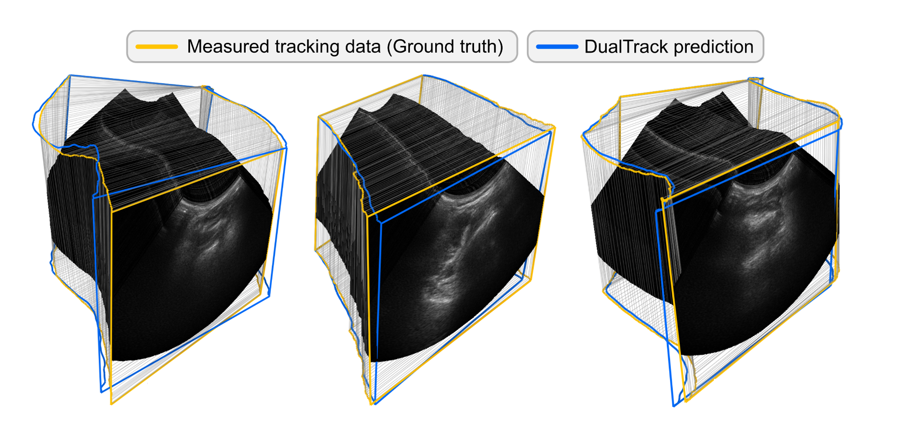
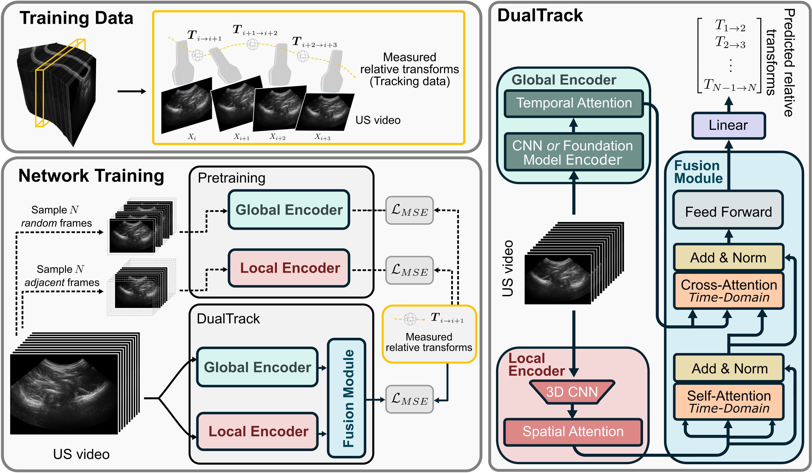
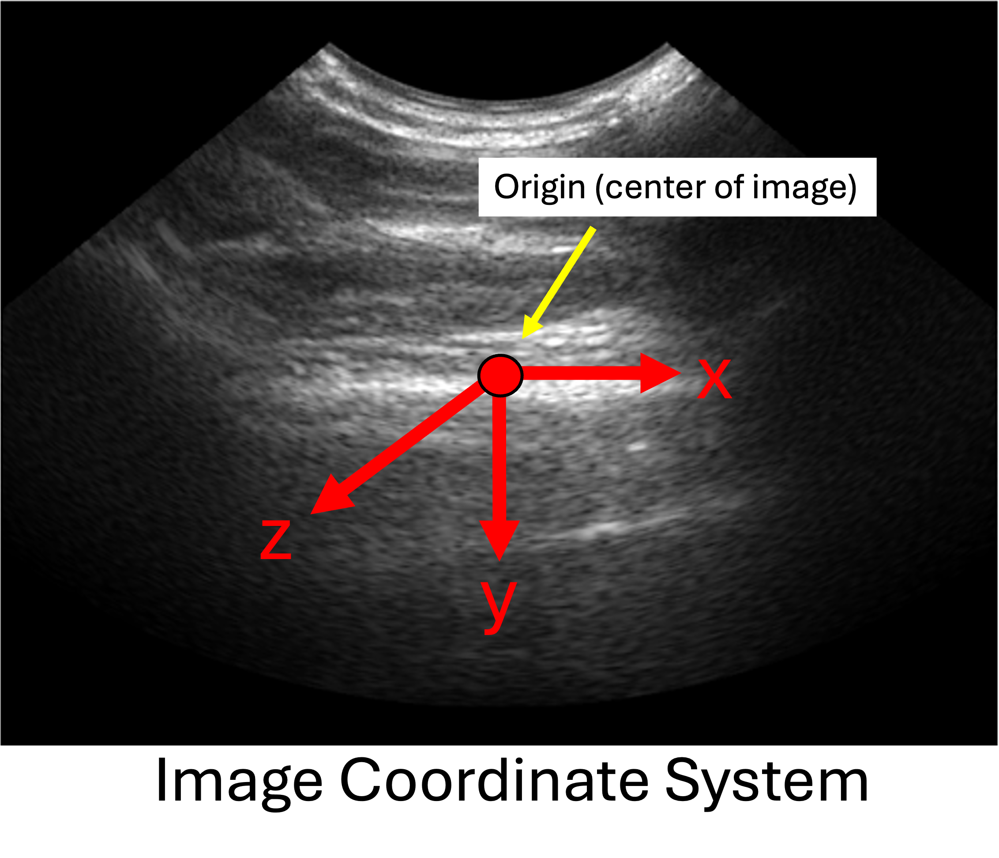

# DualTrack: Sensorless 3D Ultrasound Needs Local and Global Context

Official Repo for "DualTrack: Sensorless 3D Ultrasound Needs Local and Global Context" (MICCAI ASMUS Workshop 2025, [arxiv paper](https://arxiv.org/abs/2509.09530)) and ***winner*** of the [TUS-REC 2025 challenge](https://github-pages.ucl.ac.uk/tus-rec-challenge/).



---

## Abstract

**Motivation.** 3D Ultrasound is cost-effective and has many clinical applications. AI models can analyze 2D ultrasound scans to infer the scan trajectory and build a 3D image, eliminating the need for expensive and/or cumbersome hardware used in conventional 3D ultrasound.

**Method.** Two types of information can be used to infer scan trajectory from a 2D ultrasound sequence:

- **Local features:** frame-to-frame motion cues and speckle patterns.  
- **Global features:** scan-level context such as anatomical landmarks and the shape/continuity of anatomical structures.

To best exploit these dual, complementary sources of information, we designed a network called **DualTrack**. DualTrack features a **dual-encoder** architecture, with separate modules specializing in local and global features, respectively. These features are combined using a powerful **fusion module** to predict scan trajectory.



**Results.** On the **TUS-REC 2024** benchmark—a large dataset of over 1000 forearm scans with complex trajectory shapes—DualTrack achieved an **average error of < 5 mm** (a statistically significant **18.3% improvement** over prior state-of-the-art).  
We’ve since adapted DualTrack to numerous other datasets with excellent results:

| Dataset                         | Avg. Error (mm) |
|---------------------------------|-----------------|
| Carotid artery scans            | **3.4**         |
| Thyroid scans                   | **4.9**         |
| TUS-REC 2025 Challenge Dataset  | **9.2**         |

**Efficiency.** DualTrack is efficient and runs on a consumer GPU in **< 0.5 s** for a **30-second** ultrasound scan.

---

## Highlights

- 🧭 Dual-encoder design for **local** and **global** context  
- 🔗 Robust **feature fusion** for trajectory prediction  
- 📏 **Accurate:** < 5 mm error on TUS-REC 2024; strong cross-dataset results  
- ⚡ **Fast:** sub-second inference on consumer GPUs

---

## Publicly available models: 

| Model           | Dataset | Avg. GPE Error (mm) | Download link | Config | 
|----------------|---------|---------------------|---------------|-|
| DualTrack      | TUS-REC 2024 | 4.9 (validation set) | [dualtrack_final.pt](https://downloads.imfusion.com/DualTrack/dualtrack_final.pt)| [configs/model/dualtrack.yaml](configs/model/dualtrack.yaml)|
| DualTrack Finetuned (TUS-REC 2025 Challenge winner) | TUS-REC 2025 | 9.2 | [dualtrack_ft_tus_rec_2025_v3_best.pt](https://downloads.imfusion.com/DualTrack/dualtrack_ft_tus_rec_2025_v3_best.pt) | [configs/model/dualtrack_ft_tus_rec_2025.yaml](configs/model/dualtrack_ft_tus_rec_2025.yaml) | 

Instantiate the model using the following code snippet: 

```python
from omegaconf import OmegaConf 
from src.models import get_model 

cfg_path = 'path/to/config.yaml'
cfg = OmegaConf.load(cfg_path)
cfg.checkpoint = 'path/to/checkpoint.pt'

model = get_model(**cfg)
```
---

## Acknowledgements

We thank the TUS-REC challenge organizing team for putting together the datasets used for training and benchmarking our models! If you find this work interesting please also check out the TUS-REC 2024 [paper](https://arxiv.org/abs/2506.21765) and [dataset](https://zenodo.org/records/11178509).

---

# Usage

## Installation

Create a Python environment with `python>=3.10` and install the requirements lists in `requirements.txt`.

## Data Preparation

### Data Format 

To store a tracked ultrasound sweep, this codebase uses an h5 file with the following keys/data structures: 
- `images`: $N \times H \times W$ `uint8` array containing the pixel values of each ultrasound image in the sweep. Here, $N$ is the number of timesteps in the sweep, and $H$ and $W$ are the height and witdth (axial and lateral dimensions) of the ultrasound image.
- `tracking`: $N \times 4 \times 4$ `float` array containing the sequence $T_0, T_1, ..., T_N$ of tracking transforms. Each $T_i$ is a stored as a $4 \times 4$ homogeneous transform matrix, mapping from the *image coordinate system* to the *world coordinate system*. The image system is in $mm$ relative to the center of the image, with the following orientation for a vector $(x, y, z, 1)$: 

- `dimensions`: a single array storing the image dimensions as $(W, H, 1)$
- `spacing`: a single array storing the image spacing (millimeters per pixel) as (`W_spacing`, `H_spacing`, $1$)
- `pixel_to_image`: a single $ 4\times 4$ `float` array containing the transform that maps from the *pixel coordinate system* to the *image coordinate system*. The *pixel coordinate system* has the same orientation as the *image coordinate system*, but its origin is at the top-left of the image, and its units are in pixels rather than millimeters. This is used for [dense displacement field metrics](https://github-pages.ucl.ac.uk/tus-rec-challenge/TUS-REC2024/assessment.html) which are based on the physical positions of image points. 

If you have a collection of `.h5` files in this format, it is easy to create and register a "dataset" with the code base. To prepare a dataset for training and evaluation, first create a `.csv` file containing at least 4 columns:
- an index column
- `sweep_id`, a unique id for each sweep
- `processed_sweep_path`, the `.h5` filepath corresponding to the sweep
- `split`, one of `[train, val]` indicating whether the sweep should be used for 

Finally, you should register your dataset by creating a file (or adding to a file) located at [data/datasets.yaml](data/datasets.yaml) with the following format: 

```yaml
tus-rec: 
    data_csv_path: /path/to/metadata.csv

my-dataset-2: 
    data_csv_path: "..."
```

Now, the dataset will be registered with the codebase. You can test this by running: 

```python
from src.datasets.sweeps_dataset_v2 import SweepsDataset
ds = SweepsDataset(name='tus-rec')
print(ds[0]['images'].shape) # print the loaded sweep shape (N_timesteps x H x W) array
```

### TUS-REC To DualTrack Format Conversion
If you come from the TUS-REC Challenge, we have provided a convenient script to convert their data into our format. The script [scripts/data/convert_tus_rec_format_to_dualtrack_format.py](scripts/data/convert_tus_rec_format_to_dualtrack_format.py) will do the job. You simply need to prepare a `.csv` file pointing to the TUS-REC challenge input files. To receive help from the command line about how to run the script, run: 
```shell 
python scripts/data/convert_tus_rec_format_to_dualtrack_format.py -h
```
Feel free to raise a github issue if there are any problems with using this script.

## Run Model Training and Evaluation

DualTrack uses the `train.py` script for training and `evaluate.py` script for evaluation, for example:
```shell
python train.py -c path/to/config --log_dir="experiment/v0"
python evaluate.py -c path/to/config --log_dir="experiment/eval/v0"
```

*Note*: Training scripts will generate a log directory where checkpoints (best/last) will be saved. Certain experiments will use the checkpoints of a previous experiment to initialize components of the model.

Training configurations are found in the folder [configs/dualtrack_train_tus_rec/](configs/dualtrack_train_tus_rec/), and evaluation configurations are found in the folder [configs/dualtrack_evaluation](configs/dualtrack_evaluation). A typical config looks like the following: 

```yaml
model:
  name: dualtrack_loc_enc_stg1

data: # dataset options
  version: local_encoder 
  dataset: tus-rec # <- use the name you registered your dataset with
  sequence_length_train: 16
  augmentations: true

train: # training options
  lr: 0.0001
  epochs: 5000
  warmup_epochs: 0
  weight_decay: 0.001
  batch_size: 16
  val_every: 100

seed: 0
device: cuda
use_amp: true

logger: wandb # could be tensorboard, or console if not using wandb
logger_kw:
  wandb_project: dualtrack # logger specific options

debug: false
```

## Training DualTrack

Training DualTrack involves three main steps: 
1. Pretrain the local encoder
2. Pretrain the global encoder
3. Train the final model 

### 1. Pretraining Local Encoder

Training the fusion model happens in 3 stages:

Pretraining step 1 - we pretrain the 3d CNN backbone on small subsequences of images for 5000 epochs (should take 4-5 days on NVIDIA A40 GPU). Use [this config](configs/dualtrack_train_tus_rec/local_encoder/stage1.yaml).

Pretrain step 2 - we add a vit stage for frame-wise spatial self-attention on top of the frozen CNN backbone of stage 1 using [this config](configs/dualtrack_train_tus_rec/local_encoder/stage2.yaml). You will need to edit the `model.backbone_weights` field to point to the best checkpoint from the step 1 experiment.

Pretrain step 3 - here we add temporal attention stage and pretrain it on top of the frozen CNN + vit model of stage 2 using [this config](configs/dualtrack_train_tus_rec/local_encoder/stage3.yaml). Similarly, edit `model.backbone_weights`.

### 2. Pretraining Global Encoder

The second step of DualTrack is to pretrain the global encoder using sparsely sampled subsequences of the ultrasound frames. The global encoder consists of an image backbone and then a transformer temporal self-attention stage. Here we have several options for the image backbone: CNN, iBOT, MedSAM, and USFM. The code can easily be adapted to using other backbones. Note that some backbones require pretrained weights or add dependencies. Choose one of the configs in [configs/dualtrack_train_tus_rec/global_encoder](configs/dualtrack_train_tus_rec/global_encoder) (we recommend `cnn.yaml` as a good starting point with no extra dependencies). 

### 3. Training Fusion Model 

The final step is to combine the global and local encoders using a fusion module. The relevant config is [configs/dualtrack_train_tus_rec/dualtrack.yaml](configs/dualtrack_train_tus_rec/dualtrack.yaml). You need to edit the config to point to the local encoder and global encoder checkpoints to load their weights.

## Evaluation

Scripts will log aggregate metrics information from the training and validation sets throughout training. Once we have our final model, to run a full test routine, we can use `evaluate.py` script. For example, to reproduce the numbers from the bottom row of Table 1 in the paper, we can run:
```shell
DUALTRACK_FINAL_CHECKPOINT_PATH=/path/to/dualtrack_final/ python evaluate.py -c configs/dualtrack_evaluation/dualtrack_final.yaml # -h for help with extra eval options.
```

## Finetuning DualTrack

DualTrack adapts readily to new datasets through finetuning. For example, see [configs/tus_rec_challenge_2025](configs/tus_rec_challenge_2025) which configures a sequence of finetuning experiments to adapt the original DualTrack model to the TUS-REC 2025 challenge winning model! In [configs/tus_rec_challenge_2025/stg0.yaml](configs/tus_rec_challenge_2025/stg0.yaml), we've highlighted some relevant config flags and their purpose.

## Baselines 

We reproduced the following baselines for tracking estimation:

### 2-Frame CNN:

We have the 2-Frame CNN method based on [Prevost et al. 2018](https://pubmed.ncbi.nlm.nih.gov/29936399/). To train it, run: 
```bash
python scripts/baselines/run_baseline_2_frame_cnn_reprod.py --log_dir experiments/baselines/2-frame-cnn --scheduler=none --model efficientnet_b1 --epochs 6700 --batch_size=16 --optimizer=adam --epoch_mode tus_rec --validate_every 100 --dataset tus-rec --val_datasets tus-rec --flip_h_prob=.5 --reverse_sweep_prob=0.5 --skip_frame_prob=0.2 
```
To run a full test loop, run: 
```bash 
python scripts/baselines/run_baseline_2_frame_cnn_reprod.py --dataset tus-rec-val --model efficientnet_b1 --epochs 6700 --train_dir experiments/baselines/2-frame-cnn --test_dataset tus-rec-val
```

### DCLNet

To run the DCLNet method of [Guo et al. 2020](https://arxiv.org/abs/2006.07694), run: 

```bash
# train
python scripts/baselines/train_dcnet.py -c scripts/baselines/dcnet.yaml --log_dir=experiments/baselines/dcnet

# test 
python scripts/baselines/train_dcnet.py test --train_dir=experiments/baselines/dcnet --test_dataset tus-rec-val
```

### MoNet

```bash 
# train 
python scripts/baselines/run_monet_baseline.py --epochs=3000 --log_dir=experiments/baselines/monet

# test
python scripts/baselines/run_monet_baseline.py --batch_size=1 --use_full_scan_for_val --log_dir=experiments/baselines/monet --dataset=tus-rec-val test 
```

### Hybrid Transformer

Hybrid transformer is implemented based on the paper "Spatial Position Estimation Method for 3D Ultrasound Reconstruction Based on Hybrid Transfomers" [Ning et al. 2022](https://ieeexplore.ieee.org/abstract/document/9761499?casa_token=_ZXiTiUncyQAAAAA:Zj5R8rlZW4iGlmaNKS-2n7Eo6qCApXZNh99orsoHr3vhzqTSXcL5pf5Vw6wa3NKpLrgj-iuZ2Hg)

The standard method as described in the paper can be run as follows: 
```bash 
python scripts/baselines/run_ning_et_al_reprod.py --hidden_size=128 --log_dir=experiments/baselines/hybrid_transformer 
```

We found it to improve performance and reduce computational complexity of training to implement a 2-stage training setup for this model, where we pretrain the CNN component, export its features, then train the transformer component on top of these features (unlike the original paper which used end to end training). To reproduce these steps, we run the following 

1. pretrain the cnn 

```bash
python scripts/dualtrack_legacy/train_local_encoder.py --log_dir=experiments/baselines/hybrid_transformer/stage1 --epochs=5000 --lr=1e-4 --weight_decay=1e-3 --run_validation_every_n_epochs=100 --batch_size=16 --sequence_length_train=16 --augmentations --model=vidrn18_small_window_trck_reg_causal
```

2. export its features 
```bash 
python scripts/dualtrack_legacy/train_local_encoder.py --log_dir=experiments/baselines/hybrid_transformer/stage1 --batch_size=1 --model=vidrn18_small_window_trck_reg_causal --model_kwargs checkpoint=experiments/baselines/hybrid_transformer/stage1/checkpoint/best.pt --cached_features_file experiments/baselines/hybrid_transformer/stage1/features.h5 export_features

python scripts/dualtrack_legacy/train_local_encoder.py --log_dir=experiments/baselines/hybrid_transformer/stage1 --batch_size=1 --model=vidrn18_small_window_trck_reg_causal --model_kwargs checkpoint=experiments/baselines/hybrid_transformer/stage1/checkpoint/best.pt --cached_features_file experiments/baselines/hybrid_transformer/stage1/features.h5 --dataset=tus-rec-val export_features
``` 

3. train on top of these features
```bash
python scripts/baselines/run_ning_et_al_reprod.py --features_path=data/pre-computed-features/lively-blaze_causal/feats.h5 --hidden_size=128 --log_dir=experiments/baselines/hybrid_transformer/stage2
```

